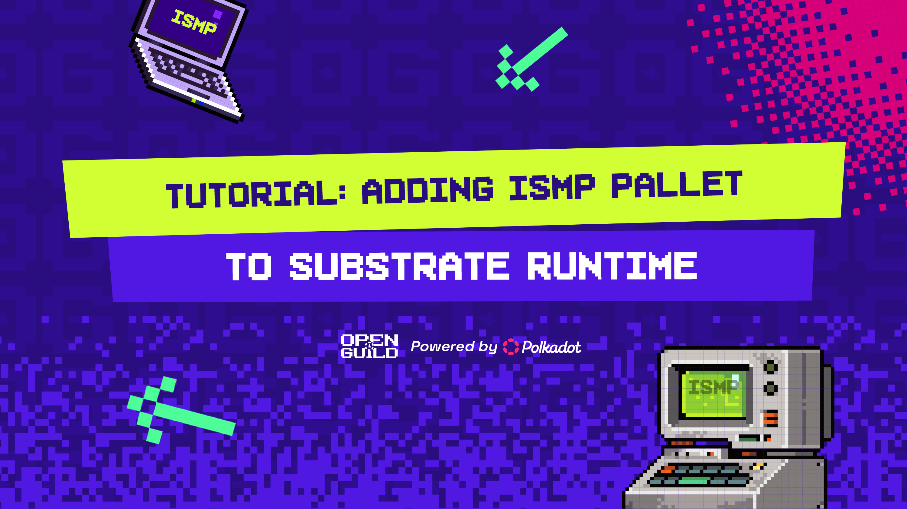

# 📚 Tutorial: Adding ISMP Pallet to Substrate Runtime

This tutorial will guide you through the process of adding an ISMP (Interoperable State Machine Protocol) pallet to your Substrate runtime. ISMP allows for interoperability between different blockchain networks, enabling cross-chain communication and data transfer.

## 📝 Prerequisites

Before we start, ensure you have the following:

1. **🦀 Rust**: Install Rust and set up your environment.
   - Install Rust: [Rust Installation Guide](https://www.rust-lang.org/tools/install)
   - Add the wasm32-unknown-unknown target:
     ```bash
     rustup target add wasm32-unknown-unknown
     ```
   - Install the nightly toolchain:
     ```bash
     rustup toolchain install nightly
     rustup default nightly
     ```

2. **💻 Visual Studio Code (VS Code)**: Set up VS Code for Rust and Substrate development.
   - Download and install VS Code from the [official website](https://code.visualstudio.com/).
   - Install the following extensions in VS Code:
     - **Rust Extension**:
       - Go to the Extensions view (`Ctrl+Shift+X`).
       - Search for "Rust" and install the [Rust extension by rust-lang](https://marketplace.visualstudio.com/items?itemName=rust-lang.rust).
     - **Substrate Extension**:
       - In the Extensions view, search for "Substrate" and install the [Substrate extension](https://marketplace.visualstudio.com/items?itemName=paritytech.vscode-substrate).
     - **Rust Analyzer Extension (Recommended)**:
       - This extension provides enhanced Rust language support, including code completion and inline error checking.
       - Search for "Rust Analyzer" in the Extensions view and install the [Rust Analyzer extension](https://marketplace.visualstudio.com/items?itemName=matklad.rust-analyzer).

3. **🛠️ Substrate Node Template**: Clone and set up the Substrate Node Template.
   ```bash
   git clone https://github.com/substrate-developer-hub/substrate-node-template
   cd substrate-node-template
   ```

### 📦 Setup on Different Operating Systems

#### Windows
1. Install [Visual Studio](https://visualstudio.microsoft.com/) with C++ build tools.
2. Install [Windows Subsystem for Linux (WSL)](https://docs.microsoft.com/en-us/windows/wsl/install) for a Linux-like environment.
3. Follow the Linux instructions within WSL.

#### macOS
1. Install Xcode and Xcode Command Line Tools.
2. Install Homebrew and use it to install additional dependencies:
   ```bash
   brew install openssl cmake llvm
   ```

#### Linux (Ubuntu/Debian)
1. Install build essentials and OpenSSL:
   ```bash
   sudo apt update
   sudo apt install build-essential openssl libssl-dev clang
   ```

## 🚀 Step 1: Set Up a New Ink! Project

Create a new Ink! project for your ISMP pallet.

```bash
cargo contract new ismp
cd ismp
```

## 🛠️ Step 2: Update Cargo.toml

Open the `Cargo.toml` file in your project and update the dependencies:

### Updating Cargo.toml for ISMP Pallet

#### Core Configuration
```toml
[package]
name = "pallet-ismp"
version = "0.1.0"
authors = ["[Your Name] <[your_email@example.com]>"]
edition = "2021"
```

#### Primary Dependencies
```toml
[dependencies]
ink = { version = "4.3", default-features = false }
scale = { package = "parity-scale-codec", version = "3", default-features = false, features = ["derive"] }
scale-info = { version = "2.9", default-features = false, features = ["derive"], optional = true }

# Substrate Dependencies
frame-support = { default-features = false, git = "https://github.com/paritytech/substrate.git", branch = "polkadot-v0.9.37" }
frame-system = { default-features = false, git = "https://github.com/paritytech/substrate.git", branch = "polkadot-v0.9.37" }
sp-std = { default-features = false, git = "https://github.com/paritytech/substrate.git", branch = "polkadot-v0.9.37" }
```

#### Development Dependencies
```toml
[dev-dependencies]
ink_e2e = "4.3"
```

#### Library Configuration
```toml
[lib]
path = "src/lib.rs"
```

#### Feature Flags
```toml
[features]
default = ["std"]
std = [
    "ink/std",
    "scale/std",
    "scale-info/std",
    "frame-support/std",
    "frame-system/std",
    "sp-std/std",
]
ink-as-dependency = []
```

#### Dependency Breakdown

##### Essential Components
- `ink`: Smart contract framework
- `scale`: Encoding/decoding library (SCALE codec)
- `scale-info`: Type information for SCALE
- `frame-support`: Core Substrate functionality
- `frame-system`: System-level operations
- `sp-std`: Standard library features

##### Features Configuration
- `default`: Enables standard library features
- `std`: Specific standard library implementations
- `ink-as-dependency`: For using as dependency in other projects

##### Key Points
1. Using git dependencies for Substrate components
2. All dependencies configured for no-std compatibility
3. Features organized for both native and WebAssembly compilation
4. Development tools included for testing

## 🧑‍💻 Step 3: Implement ISMP Pallet Logic

Replace the contents of `src/lib.rs` with the following improved code:


### Basic Setup
```rust
#![cfg_attr(not(feature = "std"), no_std)]
pub use pallet::*;

#[frame_support::pallet]
pub mod pallet {
    use frame_support::{dispatch::DispatchResultWithPostInfo, pallet_prelude::*};
    use frame_system::pallet_prelude::*;
    use sp_std::vec::Vec;
}
```

This section:
- Enables no_std compatibility for the runtime environment
- Imports necessary Substrate framework components
- Sets up the main pallet module

### Configuration and Structure
```rust
#[pallet::config]
pub trait Config: frame_system::Config {
    type Event: From<Event<Self>> + IsType<<Self as frame_system::Config>::Event>;
}

#[pallet::pallet]
#[pallet::generate_store(pub(super) trait Store)]
pub struct Pallet<T>(_);
```

Key components:
- Config trait defines pallet requirements
- Event type specification for chain events
- Pallet struct handles storage

### Storage Implementation
```rust
#[pallet::storage]
#[pallet::getter(fn messages)]
pub type Messages<T: Config> = StorageMap<
    _,                  // Default hasher
    Blake2_128Concat,   // Hashing algorithm
    T::AccountId,       // Key: account ID
    Vec<u8>,           // Value: message content
    ValueQuery         // Default behavior
>;
```

Storage features:
- Uses StorageMap for message data
- Blake2_128Concat for efficient hashing
- Maps account IDs to message content
- Automatic getter function generation

### Events and Errors
```rust
#[pallet::event]
#[pallet::generate_deposit(pub(super) fn deposit_event)]
pub enum Event<T: Config> {
    MessageStored(T::AccountId, Vec<u8>),
    MessageSent(T::AccountId, Vec<u8>),
}

#[pallet::error]
pub enum Error<T> {
    MessageTooLong,
    NoMessageFound,
}
```

Defines:
- MessageStored event: Triggered when storing messages
- MessageSent event: Triggered when transferring messages
- Error types for validation failures

### Core Functions
```rust
#[pallet::call]
impl<T: Config> Pallet<T> {
    #[pallet::weight(10_000 + T::DbWeight::get().writes(1))]
    pub fn store_message(
        origin: OriginFor<T>, 
        message: Vec<u8>
    ) -> DispatchResultWithPostInfo {
        let sender = ensure_signed(origin)?;
        ensure!(message.len() <= 256, Error::<T>::MessageTooLong);
        
        <Messages<T>>::insert(&sender, message.clone());
        Self::deposit_event(Event::MessageStored(sender, message));
        Ok(().into())
    }

    #[pallet::weight(10_000 + T::DbWeight::get().reads(1) + T::DbWeight::get().writes(1))]
    pub fn send_message(
        origin: OriginFor<T>, 
        recipient: T::AccountId
    ) -> DispatchResultWithPostInfo {
        let sender = ensure_signed(origin)?;
        let message = <Messages<T>>::get(&sender);
        ensure!(!message.is_empty(), Error::<T>::NoMessageFound);

        <Messages<T>>::insert(&recipient, message.clone());
        <Messages<T>>::remove(&sender);
        
        Self::deposit_event(Event::MessageSent(sender, message));
        Ok(().into())
    }
}
```

Core functionality:
1. store_message:
   - Validate message size
   - Stores message for account
   - Emits MessageStored event

2. send_message:
   - Checks message existence
   - Transfers messages between accounts
   - Removes from sender
   - Emits MessageSent event

### Testing Framework
```rust
#[cfg(test)]
mod tests {
    use super::*;
    use frame_support::{assert_ok, construct_runtime, parameter_types};
    use sp_core::H256;
    use sp_runtime::{
        testing::Header,
        traits::{BlakeTwo256, IdentityLookup},
    };

    type UncheckedExtrinsic = frame_system::mocking::MockUncheckedExtrinsic<Test>;
    type Block = frame_system::mocking::MockBlock<Test>;

    construct_runtime!(
        pub enum Test where
            Block = Block,
            NodeBlock = Block,
            UncheckedExtrinsic = UncheckedExtrinsic,
        {
            System: frame_system::{Pallet, Call, Config, Storage, Event<T>},
            ISMPModule: pallet_ismp::{Pallet, Call, Storage, Event<T>},
        }
    );

    // Test helper
    fn new_test_ext() -> sp_io::TestExternalities {
        let t = frame_system::GenesisConfig::default()
            .build_storage::<Test>()
            .unwrap();
        t.into()
    }

    #[test]
    fn store_message_works() {
        new_test_ext().execute_with(|| {
            let message = vec![1, 2, 3, 4];
            assert_ok!(ISMPModule::store_message(Origin::signed(1), message.clone()));
            assert_eq!(ISMPModule::messages(1), message);
        });
    }

    #[test]
    fn send_message_works() {
        new_test_ext().execute_with(|| {
            let message = vec![1, 2, 3, 4];
            assert_ok!(ISMPModule::store_message(Origin::signed(1), message.clone()));
            assert_ok!(ISMPModule::send_message(Origin::signed(1), 2));
            assert_eq!(ISMPModule::messages(2), message);
            assert_eq!(ISMPModule::messages(1), Vec::<u8>::new());
        });
    }
}
```

Testing components:
1. Test environment setup
   - Mock runtime configuration
   - Test externalities creation
   
2. Test cases
   - store_message validation
   - send_message functionality
   - Message transfer verification

#### Key Takeaways

1. Storage:
   - Uses StorageMap for efficient message storage
   - Account-based message mapping

2. Functions:
   - Message storage with size validation
   - Secure message transfer between accounts
   - Event emission for tracking

3. Testing:
   - Comprehensive test framework
   - Mock runtime environment
   - Core functionality verification

#### This improved code adds the following enhancements:
- More comprehensive error handling
- A `send_message` function for transferring messages between accounts
- More thorough test cases

## 🔨 Step 4: Integrate the ISMP Pallet into Your Runtime

1. Open `runtime/Cargo.toml` and add the ISMP pallet as a dependency:
   ```toml
   [dependencies]
   # ... other dependencies ...
   pallet-ismp = { version = "0.1.0", default-features = false, path = "../pallets/ismp" }

   [features]
   default = ["std"]
   std = [
       # ... other std features ...
       "pallet-ismp/std",
   ]
   ```

2. Open `runtime/src/lib.rs` and implement the `Config` trait for the ISMP pallet:
   ```rust
   /// Configure the pallet-ismp in pallets/ismp.
   impl pallet_ismp::Config for Runtime {
       type Event = Event;
   }
   ```

3. In the same file, add the ISMP pallet to the `construct_runtime!` macro:
   ```rust
   construct_runtime!(
       pub enum Runtime where
           Block = Block,
           NodeBlock = opaque::Block,
           UncheckedExtrinsic = UncheckedExtrinsic
       {
           // ... other pallets ...
           ISMP: pallet_ismp,
       }
   );
   ```

## 🌐 Step 5: Update the Chain Spec

If your ISMP pallet requires any initial configuration or genesis state, update your chain spec:

1. Open `node/src/chain_spec.rs`
2. Locate the `testnet_genesis` function (or equivalent for your setup)
3. Add any necessary initial configuration for the ISMP pallet:
   ```rust
   // Example (modify as needed for your specific implementation)
   ismp: ISMPConfig {
       // Add any initial configuration here
   },
   ```

## 🏃‍♂️ Step 6: Compile and Run

Now that you've integrated the ISMP pallet, it's time to compile and run your node.

1. Compile the node:
   ```bash
   cargo build --release
   ```

2. Run the node:
   ```bash
   ./target/release/node-template --dev
   ```

## 🧪 Step 7: Testing the ISMP Pallet

You can test the ISMP pallet functionality using the Polkadot.js Apps interface:

1. Connect to your local node using [Polkadot.js Apps](https://polkadot.js.org/apps/).
2. Navigate to "Developer" -> "Extrinsics".
3. Select the ISMP pallet and choose either the `storeMessage` or `sendMessage` function.
4. Submit transactions to test the pallet's functionality.
5. Check the events in the "Network" -> "Explorer" section to verify that the actions were successful.

## 🔍 Advanced Topics

To further enhance your ISMP implementation, consider exploring:

1. **Cross-chain message verification**: Implement cryptographic proofs for verifying messages from other chains.
2. **Message queuing**: Add a system for queuing and processing messages in order.
3. **Gas fee handling**: Implement a system for handling gas fees for cross-chain operations.
4. **Integration with other protocols**: Explore integration with existing cross-chain protocols like IBC (Inter-Blockchain Communication).

## 🎉 Conclusion

Congratulations! You've successfully added an ISMP pallet to your Substrate runtime. This foundation can be extended to implement more complex cross-chain communication protocols.

Remember to thoroughly test your implementation and consider all security implications when working with cross-chain communications. For more information and advanced use cases, explore the [Substrate documentation](https://docs.substrate.io/) and join the [Substrate Developer Hub](https://substrate.io/developers/) community.

Happy coding, and may your chains communicate seamlessly! 🚀🔗
